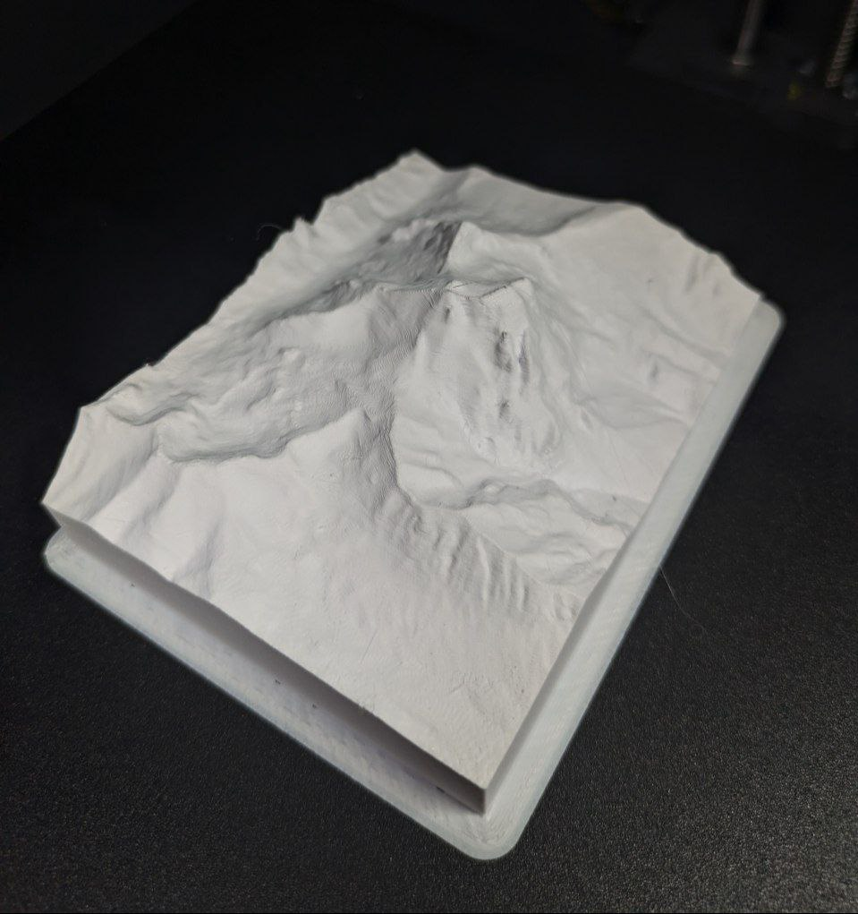

# GeoSTL

Convert GeoTIFF Digital Elevation Model (DEM) data into watertight STL files for 3D printing terrain models. Requires a projected GeoTIFF (e.g. UTM) as input — WGS84/geographic CRS is not supported.




## Install

With [uv](https://docs.astral.sh/uv/) (no install needed, dependencies are resolved automatically):
```bash
uv run dem2stl.py --help
```

Or with pip:
```bash
pip install -r requirements.txt
python dem2stl.py --help
```

There's also a crop utility:
```bash
uv run demcrop.py dem.tif --bounds 13.3 42.35 13.65 42.55
```

## Usage

```bash
uv run dem2stl.py <input.tif> --bounds SW_LON SW_LAT NE_LON NE_LAT [--scale N] [--base-height METERS] [--output FILE]
```

### Arguments

| Argument | Description |
|---|---|
| `input` | Input GeoTIFF file (.tif) |
| `--bounds` | Crop rectangle: SW longitude, SW latitude, NE longitude, NE latitude (WGS84) |
| `--scale` | Map scale 1:N. Default: `10000` (1km = 100mm). STL output is in mm. |
| `--base-height` | Absolute elevation (m) for the model base. Default: minimum elevation in crop |
| `--output` | Output STL file. Default: `<input_name>.stl` |

### Examples

Basic conversion:
```bash
uv run dem2stl.py w47085_s10.tif --bounds 13.533 42.441 13.596 42.496
```

With explicit base height (for stacking pieces side-by-side):
```bash
uv run dem2stl.py w47085_s10.tif --bounds 13.533 42.441 13.596 42.496 --base-height 500
```

Custom output file:
```bash
uv run dem2stl.py w47085_s10.tif --bounds 13.533 42.441 13.596 42.496 --output gran_sasso.stl
```

### Stacking Pieces

To print adjacent terrain tiles that fit together, use the same `--base-height` for all pieces. This ensures they share the same elevation reference and align when placed next to each other.

```bash
# Tile A
uv run dem2stl.py dem.tif --bounds 13.50 42.40 13.55 42.45 --base-height 400 --output tile_a.stl
# Tile B (adjacent)
uv run dem2stl.py dem.tif --bounds 13.55 42.40 13.60 42.45 --base-height 400 --output tile_b.stl
```

If terrain in a tile goes below the base height, the tool warns you and asks to confirm before clipping those areas flat.

## Tests

```bash
uv run --with pytest pytest tests/
```

## How It Works

1. Reads the GeoTIFF and auto-detects its CRS
2. Transforms lat/lon bounds to the file's coordinate system
3. Crops the DEM to the specified rectangle
4. Scales all coordinates to mm based on `--scale`
5. Generates a watertight mesh: top surface + flat bottom (2 triangles) + 4 side walls
6. Writes binary STL
